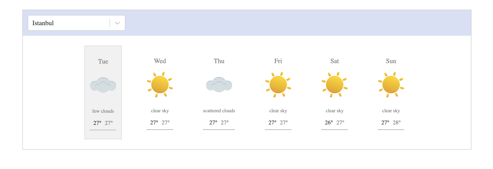

# Weather Forecast Application
This project is a React application that provides a 7-day weather forecast for a selected city using the OpenWeatherMap API. It uses the Axios library to fetch weather data and is built with React.

## Features
#### 7-day weather forecast for the selected city.
#### Weather information is displayed in Celsius (metric) units.

## Technologies Used
#### React: A frontend library for building user interfaces.
#### Axios: A promise-based HTTP client for making API requests.

## Installation
#### Clone this repository: git clone https://github.com/Semanur-Arslan/Weather-App.git
#### Install dependencies: npm install
#### Start the application: npm start

## Usage
#### When the application starts, it prompts the user to enter a city name.
#### After entering the city name, the 7-day weather forecast data will be displayed on the screen.

